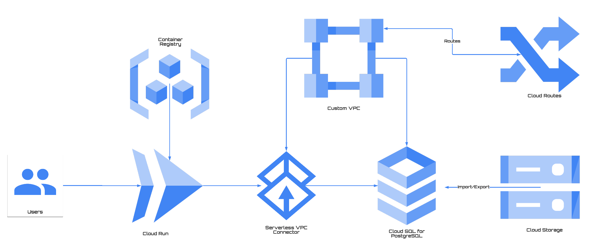

 

# Serverless on Google Cloud

## What's this

Welcome to Serverless wonderland on Google Cloud, the goal of this repo is to offer a collection of best practices and tutorrials to better leverage Serverless offering from Google Cloud. Currently the content has been categorized for the following subjects:

- General
- Networking 
- Storage
- Day 2 Operation 
- CI/CD
- Tooling

Will include advanced topics in the future: 

- Solutions
- Workaround for something

>[Live docs](https://cc4i.github.io/multi-serverless/)

## Contributing

Encourage you to contribute to this repo if you have implemented a practice that has proven to solve something, just open an issue or a pull request to share with us, please.

## Notes
Starring the repo if you feel helpful, that's the big motivation and thanks.