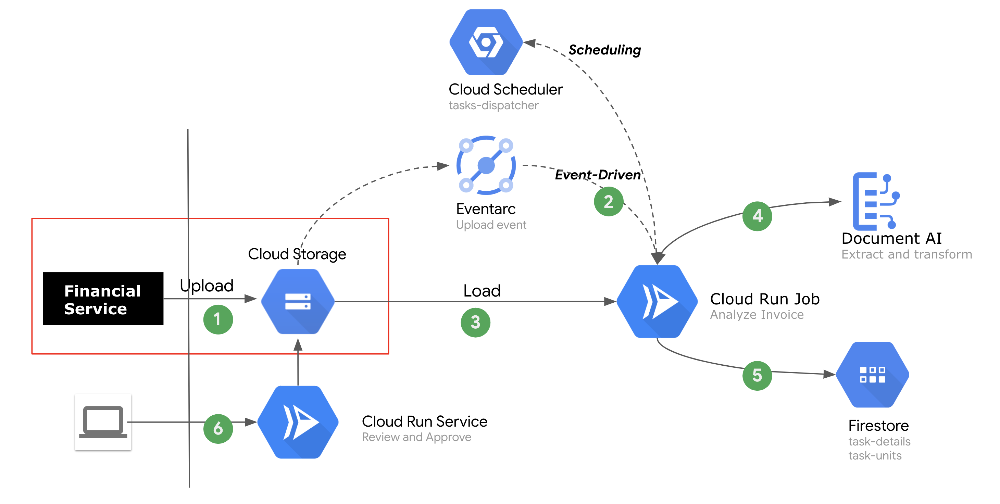

# 

# Description

We assusme a scenario, which includes following goals:

- Rapidly refactor exsiting workflows
- Integrate with existing system without harshness
- Leverage the inteligence power in Google Cloud
- Highly scalable and flexible
- Support event-driven or scheduled-task 

Accomplish those goals we designed a serverless based architecture with the least effort and most cost-effective manner. 

## High-level Architecture



## Prerequisite 

- [gcloud](https://cloud.google.com/sdk/docs/install), 
- [jq](https://stedolan.github.io/jq/download/), 
- [curl](https://github.com/curl/curl)

- Enable APIs in Google Cloud for following demo

```sh
# Enable services API in gcloud if not done yet
gcloud services enable cloudbuild.googleapis.com \
    eventarc.googleapis.com \
    logging.googleapis.com \
    pubsub.googleapis.com \
    run.googleapis.com \
    workflows.googleapis.com

```


## Guide
```sh
# 1. Initial environment variables 
export GOOGLE_CLOUD_PROJECT=play-with-anthos-340801
export BUCKET=$GOOGLE_CLOUD_PROJECT-demo-invoices
export PROCESSOR_NAME=invoice-parser-us
export REGION=us-central1


# 2. Create bucket for storage the files of invoice
gsutil mb -l $REGION gs://$BUCKET

# 3. Create the processor from Document AI
cat << __EOF__ > request.json
{
  "type": "INVOICE_PROCESSOR",
  "displayName": "${PROCESSOR_NAME}"
}
__EOF__

curl -X POST \
    -H "Authorization: Bearer $(gcloud auth application-default print-access-token)" \
    -H "Content-Type: application/json; charset=utf-8" \
    -d @request.json \
    "https://us-documentai.googleapis.com/v1/projects/$GOOGLE_CLOUD_PROJECT/locations/us/processors" > out.txt
PROCESSOR_ID=`cat out.txt |jq -r ".name"|awk -F"/" '{print $6}'`

curl -X GET \
    -H "Authorization: Bearer $(gcloud auth application-default print-access-token)" \
    "https://us-documentai.googleapis.com/v1/projects/$GOOGLE_CLOUD_PROJECT/locations/us/processors/$PROCESSOR_ID"


# 4. Provision Cloud Run Services to uploader
gcloud run deploy uploader --region $REGION --quiet \
    --source uploader/ \
    --set-env-vars BUCKET=$BUCKET \
    --allow-unauthenticated

# 5. Provision Cloud Run Services to view/approve
gcloud run deploy reviewer --region $REGION --quiet \
    --source reviewer/ \
    --set-env-vars BUCKET=$BUCKET \
    --allow-unauthenticated

# 6. Provision Cloud Run Jobs to process invoices. Run Service to kick off Job
gcloud run deploy kicker --region $REGION --quiet \
    --source kicker/ \
    --set-env-vars JOB_NAME=invoice-processing \
    --allow-unauthenticated

gcloud beta run jobs create invoice-processing \
    --image gcr.io/$GOOGLE_CLOUD_PROJECT/invoice-processor \
    --region $REGION \
    --set-env-vars BUCKET=$BUCKET \
    --set-env-vars PROCESSOR_ID=$PROCESSOR_ID


# 7. Create a trigger to Cloud Run Jobs
SERVICE_ACCOUNT="$(gsutil kms serviceaccount -p play-with-anthos-340801)"

gcloud projects add-iam-policy-binding play-with-anthos-340801 \
    --member="serviceAccount:${SERVICE_ACCOUNT}" \
    --role='roles/pubsub.publisher'

gcloud eventarc triggers create bucket-events-trigger-run-kicker \
   --destination-run-service=kicker \
   --destination-run-region=us-central1 \
   --event-filters="type=google.cloud.storage.object.v1.finalized" \
   --event-filters="bucket=$BUCKET" \
   --service-account=828493099439-compute@developer.gserviceaccount.com \
   --location=us

# 8. Validation
# Copy files into bucket and triggering the process
gsutil cp -r incoming/*.pdf gs://$GOOGLE_CLOUD_PROJECT-invoices/incoming
gsutil cp -r incoming/brass-curve-1311.pdf gs://$GOOGLE_CLOUD_PROJECT-invoices/incoming/brass-curve-1311.pdf

# Or use uploader to upload a file 
open `gcloud run services describe uploader --region $REGION --format json|jq -r ".status.url"`

# Checkout demo through simple UI
open `gcloud run services describe reviewer --region $REGION --format json|jq -r ".status.url"`
```

## References
- [Cloud Run](https://cloud.run)
- [Document AI](https://cloud.google.com/document-ai)
- The Run Jobs was forked from Google Cloud [jobs-demo](https://github.com/GoogleCloudPlatform/jobs-demos)
