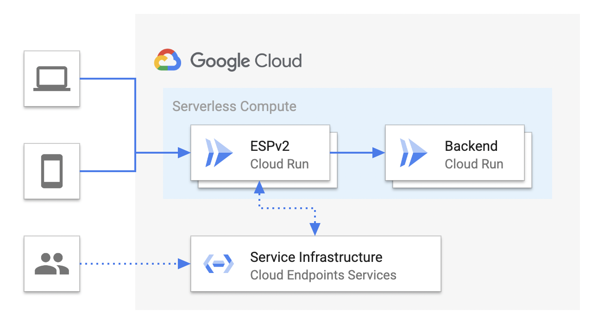

# 

## Description

In order to expose API in consistent and secure way, you can use uses the Extensible Service Proxy V2 (ESPv2) as an API gateway, so that handles request, authentication, health check, tracing, etc., for you, and you can focus more on your backend services of Cloud Run.


## High level Architecture




## Guide

```sh
# 1. Reserving a Cloud Run hostname

# 2. Configuring Cloud Endpoint with OpenAPI Specfication

# 3. Generate ESPv2 image with Cloud Endpoint

# 4.  Deploy/replace reserved Cloud Run with generated image.

# 5. Validate API and track API activity

```


## References

 - [Set up Cloud Endpoints OpenAPI for Cloud Run with ESPv2](https://cloud.google.com/endpoints/docs/openapi/set-up-cloud-run-espv2)
 - [ESPv2 configuration flags](https://cloud.google.com/endpoints/docs/openapi/specify-esp-v2-startup-options#configuration_flags)